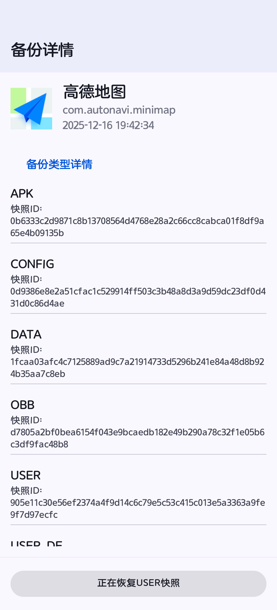
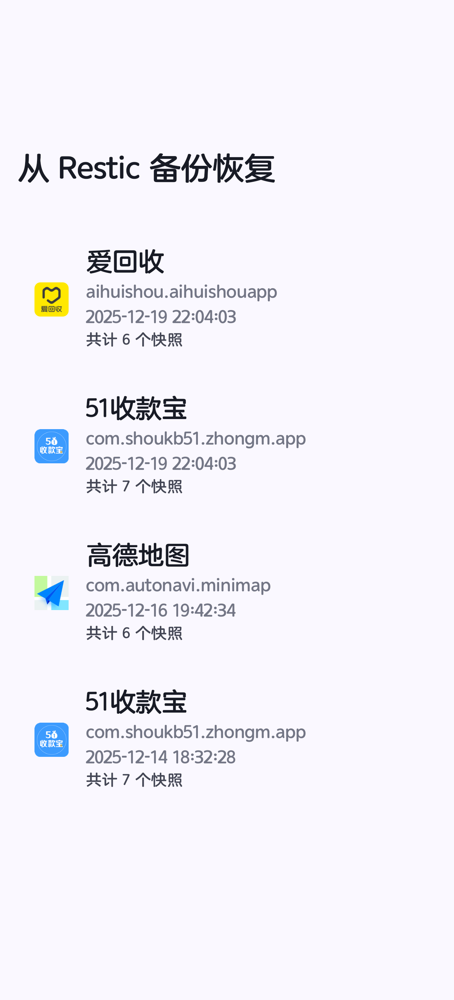
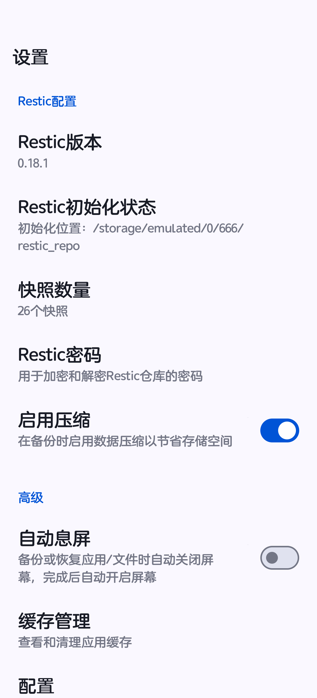

<div align="center">  

<span style="font-weight: bold"> <a href="./README.md"> English </a> | <a href="./README_zh-CN.md"> 中文 </a> </span>  

  

<h1 align="center">DataBackup Revived</h1>  

免费且开源的数据备份应用程序

</div>  

> ℹ️ **无需任何外部 Restic 二进制文件。** 本地备份/恢复由 Rust 的 `rustic_core` 库驱动（Rust 实现，兼容 restic 仓库格式），编译进 `librustic.so` 随 App 一同分发，并通过 JNI 直接调用。**不再需要下载、安装或管理独立的 Restic Android CGO 二进制文件**，此前上游二进制在 Android 上的 DNS 解析与动态链接问题也不复存在。详见 [Native JNI 迁移](#native-jni-迁移rustic-jni-分支)。

## 项目概览

<a href="https://hellogithub.com/repository/3e9dc382d4764688856238a83616de5b" target="_blank"></a>

:star: 派生自 [XayahSuSuSu](https://github.com/XayahSuSuSu/Android-DataBackup)。

## 功能特性

* :deciduous_tree: **需要 Root 权限。支持 [Magisk](https://github.com/topjohnwu/Magisk)、[KernelSU](https://github.com/tiann/KernelSU) 以及 [APatch](https://github.com/bmax121/APatch)**
* :cyclone: **多用户支持**
* :cloud: **支持多种云存储协议**
* :sunglasses: **100% 数据完整性保证**
* :zap: **极速**
* :sunny: **简单易用**
* :sparkles: **支持多版本备份**
* :rose: **本地备份基于内置 `rustic_core`（JNI，兼容 restic 仓库）的块级去重**
* :electric_plug: **无需外部二进制——`rustic_core` 编译进 `librustic.so` 并通过 JNI 调用**
* :rocket: **集成 libsu 以增强 Root 操作体验**

## 版本对比

### 云存储协议支持

| 功能                 | 旧版 (DataBackup) | 新版 (DataBackup Revived 3.0.0) |  
|--------------------| --- |-------------------------------|  
| **本地存储**           | ✅ 已支持 | ✅ **块级去重（JNI rustic，已完成）** |  
| **Tencent COS 协议** | ❌ 不支持 | ✅ **块级去重（JNI rustic，已完成）** |  
| **FTP 协议**         | ✅ 已支持 | ⏳ 待迁移到 JNI |  
| **SFTP 协议**        | ✅ 已支持 | ⏳ 待迁移到 JNI |  
| **WebDAV 协议**      | ✅ 已支持 | ⏳ 待迁移到 JNI |  
| **SMB/CIFS 协议**    | ✅ 已支持 | ⏳ 待迁移到 JNI |  

> 目前 JNI `rustic_core` 路径**覆盖本地存储**。远程协议（除腾讯云COS之外）/FTP/SFTP/WebDAV/SMB仍运行在旧路径上，**待迁移到 JNI**。
> 腾讯 COS：是兼容S3协议的对象存储，特别说明：S3之间（比如AWS S3、腾讯云COS、阿里云OSS）可能存在参数差异，目前只适配了腾讯云COS，额外的其他S3对象存储目前还没有支持，在逐步适配中，敬请期待.

### 备份架构演进

| 功能 | 旧版 | 新版 (已完成)                 |  
| --- | --- |--------------------------|  
| **本地备份引擎** | 仅 tar+zstd 压缩 | **rustic 块级增量去重（JNI，无二进制）** |  
| **Root 权限** | 自定义实现 | **集成 libsu**             |  
| **存储效率** | 线性增长 | **节省 60–90% 空间**         |  
| **数据加密** | 无 | **AES-256 加密**           |  
| **增量备份** | 不支持 | **原生支持**                 |  
| **版本管理** | 文件覆盖 | **基于快照的版本控制**            |  
| **APK 备份（本地）** | 仅压缩 | **rustic 增量去重**          |  
| **应用数据备份（本地）** | 仅压缩 | **rustic 增量去重**          |  
| **文件备份（本地）** | 仅压缩 | **rustic 增量去重** |  

### 技术变更

| 项目 | 旧版 | 新版 |  
| --- | --- | --- |  
| **应用包名** | `com.xayah.databackup.*` | `com.xayah.databackup.revived.*` |  
| **版本号** | 2.x.x | **3.0.0**（基于 rustic 的块级去重） |  
| **Root 框架** | 自定义 Root 服务 | **libsu 集成** |  
| **备份引擎** | 单一压缩 | **双层架构：非压缩 tar + rustic 块级去重与加密** |  
| **Restic/rustic 运行时** | 外部 CGO 二进制（子进程） | **进程内 `rustic_core`，通过 JNI（`librustic.so`）** |  

## JNI 迁移里程碑

> 🎯 **本地备份/恢复现已全链路迁移到进程内 `rustic_core` 库（经 JNI，`librustic.so`），彻底消除对外部 Restic 二进制的运行时依赖。所有本地 APK、应用数据、文件备份均通过 JNI rustic 路径执行，具备块级去重、AES-256 加密与快照版本控制。远程协议（S3/FTP/SFTP/WebDAV/SMB）为下一步迁移目标。**

### 🏗️ 本地双层备份架构

原始数据 → **非压缩** `tar` 打包 → **rustic 块级去重（JNI）** → 本地仓库

- **第 1 层：打包层** — 将 APK/数据/文件打包为**非压缩**的 `.tar` 归档，以最大化去重效率（例如 OBB/DATA/USER/USER_DE/MEDIA 输出 `apk.tar`）。
- **第 2 层：rustic 去重层** — 在 restic 兼容仓库上进行块级去重、AES-256 加密与快照管理（标签格式：`userId-packageName-timestamp-apk`）。

> ✅ 通过在去重前避免压缩，rustic 能更有效地识别并消除不同备份批次和设备之间的冗余数据块。

### 🔄 libsu 集成
- Root 权限通过 **libsu** 处理，获得更好的 Magisk/KernelSU/APatch 支持、改进的错误处理与更强的安全性。

### 📦 覆盖范围（本地，经 JNI rustic）
- **APK 备份**、**应用数据备份**、**文件备份** 均通过 JNI rustic 路径执行。
- 新 UI：还原列表页（浏览/选择快照）、快照详情页（类型与进度）。
- 交互流程：配置仓库 → 浏览快照 → 选择应用/文件版本 → 查看详情 → 一键还原。

### 📊 技术指标（本地）

| 特性 | 旧版备份 | rustic 备份（JNI，本地） |  
| --- | --- | --- |  
| **存储效率** | 基础压缩 | **块级去重 + 压缩** |  
| **增量备份** | 不支持 | **原生支持** |  
| **数据加密** | 无 | **AES-256 加密** |  
| **版本管理** | 文件覆盖 | **基于快照的版本控制** |  
| **还原粒度** | 批量还原 | **支持单个应用和单个文件的精准还原** |  
| **存储占用** | 线性增长 | **节省 60–90% 空间** |  
| **Root 权限** | 自定义实现 | **libsu 集成** |  
| **备份运行时** | 外部 CGO 二进制 | **进程内 `rustic_core`，通过 JNI** |  

> **DataBackup Revived 现已成为一个现代化数据管理平台，具备本地块级去重（内置 rustic，经 JNI 调用）与 libsu 集成；远程协议向 JNI 的迁移正在进行中。**

## Native JNI 迁移（`rustic-jni` 分支）

> 🎯 **本地备份/恢复已从"调用外部 Restic Android CGO 二进制"迁移到"通过 JNI 直接调用 Rust 的 `rustic_core` 库"。Rust 代码编译进 `librustic.so` 随 App 分发，彻底消除对外部二进制的运行时依赖。**

### 背景与动机

此前，所有本地备份/恢复都要调用外部 Restic Android CGO 二进制：需要单独分发/管理二进制、每次操作 fork 子进程、并解析文本/JSON 输出；上游二进制在 Android 上还存在 DNS 解析和动态链接问题。`rustic-jni` 迁移用原生进程内集成替代了它：

- **`rustic_core`** 固定到 **`0.12.0`**，作为 native 子模块参考引入。
- Rust crate 编译为**静态库**，链接进 JNI 锚点，打包为 **`librustic.so`** 随 App 分发。
- 本地操作在运行时**不再需要任何外部二进制，也不再 fork 子进程**。
- 仓库格式仍与 **restic 兼容**，现有仓库可继续使用。

### 架构

```  
Kotlin (Rustic.kt)  
      │  external fun native*  (JNI)  
      ▼  
AIDL (IRemoteRootService) ──► RemoteRootService / RemoteRootServiceImpl  （root 进程）  
      │  
      ▼  
librustic.so  （JNI 锚点 rustic.cpp + Rust 静态库）  
      │  
      ▼  
rustic_core (Rust)  ──►  本地 / S3 仓库（经 opendal backend）  
      ▲  
      └── 进度回调（字节/速度/百分比）──► Kotlin onProgress(JJF)V  
```  

- **Rust 侧**（`source/native/src/main/jni/external/rustic/rustic`）：
    - `lib.rs` 组织 crate 模块（`error`、`jni_bridge`、`jni_progress`、`progress`、`repository`），并启用 `#![deny(improper_ctypes_definitions)]`。
    - `jni_bridge.rs` 暴露 `Java_com_xayah_libnative_Rustic_*` 符号。
    - `repository.rs` 封装完整能力集：`init_repository`、`repository_exists`、`validate_repository`、`create_snapshot`（含带进度版本）、`restore_snapshot`（含带进度版本）、`check_repository`、`forget_snapshot`、`prune_repository`、`list_snapshots_db`。
    - `list_snapshots_db` 打开仓库读取全部快照，用静态编译的 `rusqlite`（`bundled`）**直写 SQLite `.db` 文件**：含 4 张表 + `v_snapshots_full` 视图，Android 侧可用 `SQLiteDatabase.openDatabase(...)` 直接 `rawQuery(...)`。

- **进度回调**：
    - `progress.rs` 定义与 JNI 无关的 `RusticProgressCallback` trait，通过 `AndroidProgressBars` 桥接 `rustic_core` 的 `ProgressBars`；只上报字节级进度（`ProgressType::Bytes`），spinner/counter 进度隐藏。
    - 进度回调节流到每秒一次（`PROGRESS_CALLBACK_INTERVAL = 1s`）；`finish` 时上报整段传输的平均速度。
    - `jni_progress.rs` 缓存 `onProgress(JJF)V` 方法 ID，通过 `attach_current_thread` 回调 Kotlin。

- **构建接线（CMake + Corrosion）**：
    - `source/native/src/main/jni/CMakeLists.txt` 加入 `rustic` 子目录。
    - `source/native/src/main/jni/rustic/CMakeLists.txt` 通过 `FetchContent` + `corrosion_import_crate` 使用 **Corrosion (v0.6.1)** 构建 Rust 静态库（`PROFILE release`、`LOCKED`），再用 `--whole-archive` 链接进 JNI 锚点 `rustic.cpp` 生成 `librustic.so`。
    - `rustic.map` 版本脚本仅导出 `Java_com_xayah_libnative_Rustic_*` 符号。
    - Cargo release profile 开启 `lto = true`、`codegen-units = 1`、`panic = "abort"`、`strip = true`，确保原生性能。

- **Kotlin 与 AIDL 层**：
    - `Rustic.kt` 提供带 backend options（`Map<String,String>`，key/value 两个字符串数组经 JNI zip 成 map）的 Kotlin API。
    - `IRemoteRootService.aidl` 新增 10 个 Rustic 方法（`getRusticVersion`、`initRusticRepository`、`rusticRepositoryExists`、`validateRusticRepository`、`createRusticSnapshot`、`restoreRusticSnapshot`、`checkRusticRepository`、`forgetRusticSnapshot`、`pruneRusticRepository`、`listRusticSnapshotsDb`），并用 `ICallback` 传递进度。
    - root 进程启动时加载库（`System.loadLibrary("rustic")` + `Rustic.initLogger()`），`RemoteRootServiceImpl` 在 `synchronized(lock)` 下把每个 AIDL 调用转发给 `Rustic`。

- **Backend options 贯通（为 S3 铺路）**：
    - backend 选项从 Kotlin `Map<String,String>` 经 JNI 传入 `rustic_backend::BackendOptions`，使 `opendal` backend（本地 fs / S3）能接收配置。

### 迁移分阶段

- **阶段 0** — 固定 `rustic_core` 到 `0.12.0` 并同步上游源作为 JNI 参考。
- **阶段 1** — 搭建 JNI 桥并逐个能力打通：`get_version` → `init`/`exists`/`validate` → `create`/`restore`（带进度）→ `check` → `forget`/`prune` → `list_snapshots_db` 直写 SQLite；追加 opendal backend-options 贯通。
- **阶段 2** — 为新 JNI 符号接入 CMake + instrumented 测试；AIDL + `RemoteRootService` 接线。
- **阶段 3** — 本地 **restore** 迁移到 JNI rustic，贯通进度/plan 回调；发布 Rust release profile 使原生性能达到预期。

### 测试

- **Host 端测试**（`base_test.rs`）：仓库探测/校验、快照创建-恢复-校验、多源快照、带进度快照、forget/prune、写 SQLite。
- **设备端测试**（`RusticInstrumentedTest.kt`）：完整生命周期，并用 `SQLiteDatabase` 查询 `v_snapshots_full`，覆盖新增 JNI 符号与 `opendal:fs` 非空选项贯通。

## 屏幕截图 – Restic

<div align="center">  

  

  

  

</div>  

## 屏幕截图 – S3

<div align="center">  

  

  

  

  

  

  

</div>  

## 更多屏幕截图

<div align="center">  

  

  

  

</div>  

<div align="center">  

  

  

  

</div>  

## 下载

请从 [Releases](https://github.com/543069760/Android-DataBackup-S3/releases) 获取 APK。

## 翻译项目

[](https://hosted.weblate.org/engage/databackup/)

## 贡献者

感谢所有做出贡献的人！

[[贡献者名单](https://contrib.rocks/image?repo=543069760/Android-DataBackup-S3)](https://github.com/543069760/Android-DataBackup-S3/graphs/contributors)

## 支持与赞助

如果你喜欢这个应用并希望支持它变得更好，欢迎赞助我！

[](https://paypal.me/XayahSuSuSu)

[](https://afdian.net/a/XayahSuSuSu)

## 开源协议

[GNU General Public License v3.0](./LICENSE)